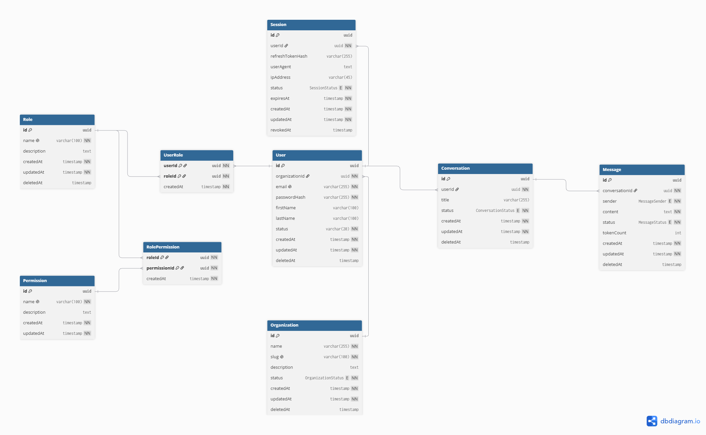

# Database Design

The database is designed around a small platform where organizations have
users, users open sessions, users own conversations, and conversations contain
messages. Roles and permissions are modeled separately so authorization data can
grow without changing the user table.

## ER Diagram

## Main Tables

| Table | Purpose |
| --- | --- |
| `Organization` | Top-level workspace or company entity. |
| `User` | Account record that belongs to an organization. |
| `Session` | Login/session record for a user. |
| `Conversation` | Conversation owned by a user. |
| `Message` | Individual message inside a conversation. |
| `Role` | Named role that can be assigned to users. |
| `Permission` | Permission that can be attached to roles. |
| `UserRole` | Join table between users and roles. |
| `RolePermission` | Join table between roles and permissions. |

## Main Relationships

- Organization has many users.
- User has many sessions.
- User has many conversations.
- Conversation has many messages.
- User and role have a many-to-many relationship through `UserRole`.
- Role and permission have a many-to-many relationship through `RolePermission`.

## Soft Deletes

Several business entities use a nullable `deletedAt` column instead of being
physically removed immediately:

- `Organization`
- `User`
- `Conversation`
- `Message`
- `Role`

API queries filter these records with `deletedAt: null` so deleted records are
hidden from normal responses while historical data can still be preserved.

## Sensitive Data

Sensitive fields are stored in the database but are not exposed by API response
selection:

- `User.passwordHash`
- `Session.refreshTokenHash`

This keeps authentication internals out of public JSON payloads.

## Indexing Strategy

The schema includes indexes for common lookup and list patterns:

- unique lookup by user email;
- filtering records by parent id, for example users by organization;
- filtering active or non-deleted records;
- sorting list endpoints by `createdAt`;
- cursor pagination with stable ordering.

Detailed query plans and index observations are documented in
`query-analysis.md`.
